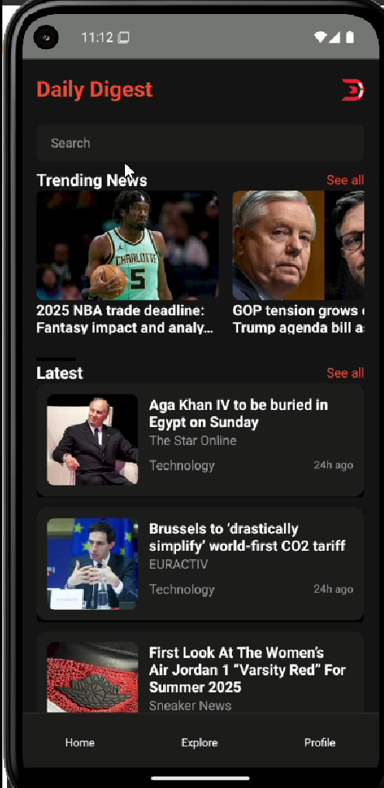

## 🚀 App Project: Daily Digest - News Aggregator App

**Daily Digest** is a full-stack news aggregator application built using the MERN stack. It fetches and displays real-time news articles via a user-friendly mobile interface.

### ✨ Key Features

- 🔍 **Searchable News Feed**  
  Browse and search the latest headlines in a smooth UI

- 📱 **React Native Frontend**  
  Built with modern design practices for seamless user experience

- 📰 **MongoDB + Express + Node Backend**  
  Handles news storage, API routes, and data management

- ⚙️ **API Integration**  
  Fetches news from a central API and serves to the app

---

## 📦 Folder Structure

```
Daily-Digest-News-Aggregator/
├── frontend/   # React Native app (user interface)
└── backend/    # Express backend with MongoDB integration
```

---

## 🛠️ How to Run

### 📍 Backend

```bash
cd backend
npm install
node index.js
```

> Runs the backend on `http://localhost:5000`

---

### 📱 Frontend

```bash
cd frontend
npm install
npx expo start
```

> Use Expo Go app or Android/iOS emulator to preview the app

---

## 📸 Gallery





---

## 🎥 Demo Video

[](https://youtube.com/shorts/8ydcAz4RDt4)

> 📌 *Click the thumbnail to watch the full walkthrough on YouTube.*
